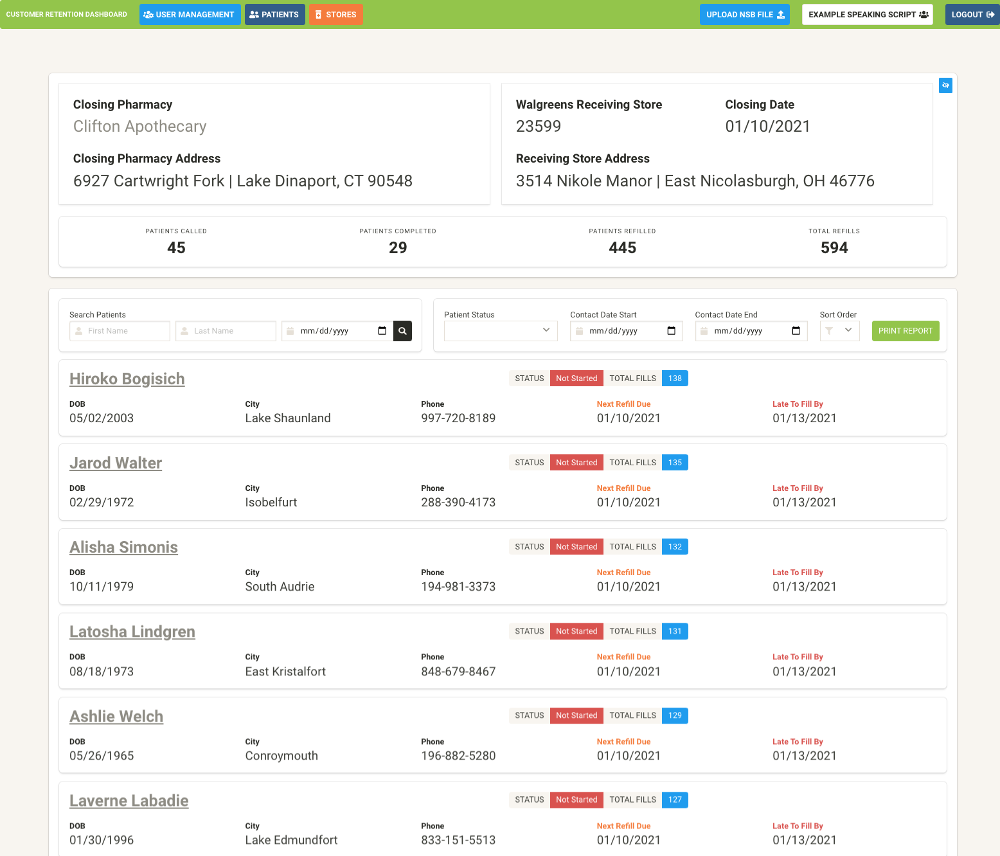
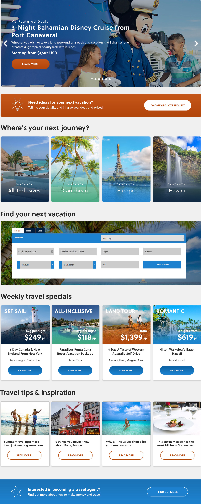
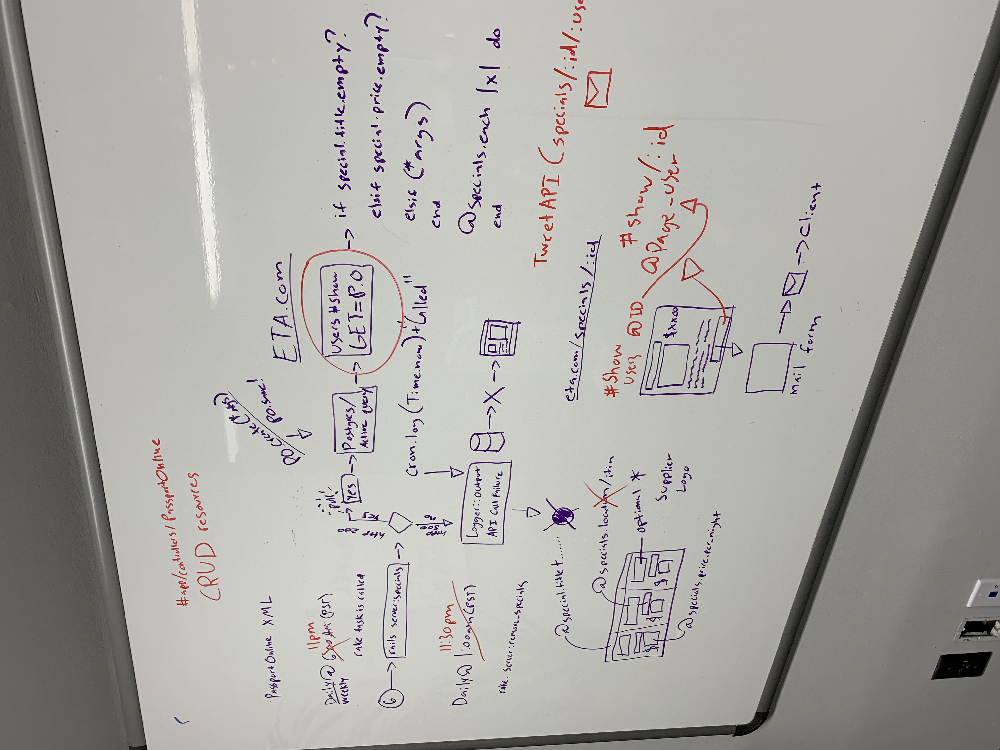

# ViewMaster &copy;
 This record retention software meets HIPAA and HITRUST regulations with encrypted and secure data. With ViewMaster, you can satisfy all the requirements for record retention and reporting from entities such as the Board of Pharmacy, CMS, DEA, and more. 

 We've archived over 5 billion records for healthcare organizations since launching!

 <b>Our Stack:</b> Ruby, Rails, Rails API, RSpec, Capybara, Postgres, Redis, Sidekiq 🔍 ✨
 

 
 

<iframe width="560" height="315" src="https://www.youtube.com/embed/TVgl5NYqqj4" frameborder="0" allow="accelerometer; autoplay; clipboard-write; encrypted-media; gyroscope; picture-in-picture" allowfullscreen></iframe>

 

  

gem "haml"
gem "dalli"
gem "sendgrid-ruby", "~> 6.1.0"
gem "prawn", "2.2.2"
gem "azure", "0.7.10"
gem "redis"
gem "mini_magick"

  

<h1 style="font-size: 3.2rem;">Evolution</h1>
Evo is a rails application that allows travel agents to create, customize and edit their own personal website. Each agent can customize each module to their own liking, and even have clients book and schedule trips with built-in air/cruise/hotel APIs.

Frontend: HTML CSS3 React JS+Axios Bootstrap 4  
Backend: Rails API  

 

We also released a public rails API for a hub of our own travel specials that work with React JS and Axios. Each component is resuable and made with the react-rails gem to be monolithic.

  

<h1 style="font-size: 3.2rem;">Etc ✨</h1>
Here are some other things I've built with teams and Web Development Agencies:
 
 

   
     
     
     
     

